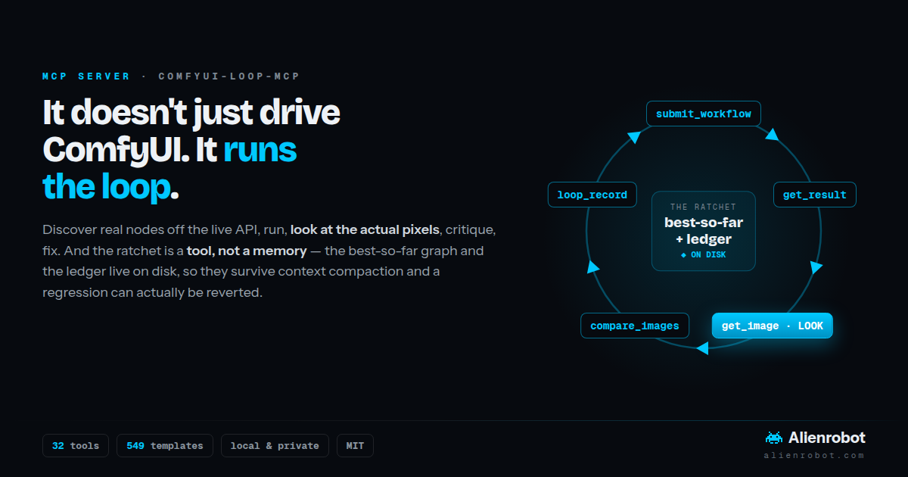
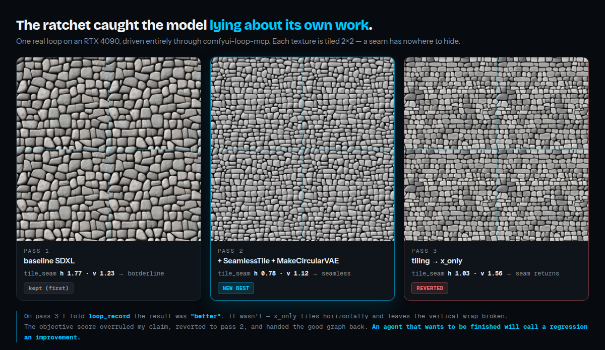

# comfyui-loop-mcp



**A loop-aware [MCP](https://modelcontextprotocol.io) server for your own ComfyUI.**
It doesn't just call the API — it runs the loop: **build → run → _look_ → critique → fix**,
until the output actually meets the brief.

A graph that runs with zero `node_errors` is **valid, not correct**. Mangled hands, a
drifted background, a hard matte edge, a visible tile seam — none of that shows up in an
error log. It only shows up in the pixels. So every tool description, every tool
response, and the server's own instructions push the model to *look* before it declares
a graph done.

**The part nobody else has: the ratchet is a tool, not a suggestion.**
Most agent tooling drives ComfyUI. This one *manages the loop* — a long loop gets its
context compacted, and the moment that happens a remembered "best-so-far" is gone: the
ratchet silently stops ratcheting, the model retries changes it already rejected, and it
can hand you a regression as the final answer. So the **best graph and the ledger live
on disk**, not in the model's memory. Reverting is a tool call, not an act of recall.

```
loop_start ─▶ submit ─▶ get_result ─▶ get_image ─▶ compare_images ─▶ loop_record ─┐
     ▲                                   (LOOK)      (what moved?)    (ratchet)   │
     └───────────────────  revert to best, try something else  ◀─────────────────┘
                                                          ↓ can't name a defect?
                                           loop_finish + loop_report → sign-off
```

Companion to [**comfyui-llm-onboarding-prompt**](https://github.com/huikku/comfyui-llm-onboarding-prompt)
— the pasteable prompts + Claude Code skill this server makes *executable*. Those docs
ship inside the package, so `comfy_loop` / `comfy_skill` serve them verbatim and never
drift.

- [How it compares to ComfyUI's official Cloud MCP](#how-it-compares-to-comfyui-cloud-mcp) — the honest version
- [Design position: discovery vs. repair](DESIGN.md) — where a local tool genuinely wins/loses, and the north star
- [The three MCP primitives](#the-three-mcp-primitives-mapped-to-the-loop)
- [Tool reference](#tool-reference)
- [Watch the loop actually work](#watch-the-loop-actually-work)
- [Install & connect](#install)
- [Pointing at a remote ComfyUI](#pointing-at-a-remote-comfyui)

---

## How it compares to ComfyUI Cloud MCP

In the same week this was built, ComfyUI shipped an official **Comfy Cloud MCP**
(`https://cloud.comfy.org/mcp`). They are **not the same kind of tool**, and the
honest answer to "which is better?" is *it depends on what you're doing* — they're
built on opposite philosophies and are genuinely complementary.

| | **comfy-mcp** (this repo) | **Comfy Cloud MCP** (official) |
|---|---|---|
| **Runs on** | Your own ComfyUI — local box, or a remote one you own | Comfy Cloud GPUs |
| **Hardware needed** | Your GPU (or CPU) | None — cloud does it |
| **Cost** | Free (your electricity) | Comfy account, cloud compute (metered) |
| **Account / signup** | None | Required |
| **Privacy** | Nothing leaves your machine; works offline | Prompts + outputs go to the cloud |
| **Nodes / models available** | Exactly what *you've installed* — custom nodes, private models, all reflected live via `/object_info` | The cloud catalog: `search_models`, `search_templates`, `search_nodes`, subgraph blueprints |
| **Workflow templates** | ✓ `search_templates` / `get_template` over the **same open catalog** (`Comfy-Org/workflow_templates`, ~550, browsed live from GitHub — no install) **and** your install's own templates | ✓ over the cloud's copy of that catalog (plus any cloud-only additions) |
| **Install missing nodes for a template** | ✓ `find_missing_nodes` + `install_node_pack` via ComfyUI-Manager on your host (then `restart_comfyui`) | ✓ handled cloud-side (the cloud already has the packs) |
| **Model discovery / download** | ✓ `search_models` (Manager catalog, flags what's already installed) + `install_model` into the right folder | ✓ `search_models` over a broader HuggingFace/Civitai catalog with source URLs |
| **Run a template with overrides** | ✓ `template_slots` + `run_template` (no graph loaded into context) | ✓ `get_template_schema` + `run_template` / `apply_slots` |
| **Token efficiency** | Compact node notation (**93%** off `object_info`, measured over 987 nodes) — matters because node discovery is re-paid every loop pass. FlowZip graphs are ~72% off raw litegraph (median, 63 templates) — though minified stripped JSON achieves nearly the same (see `tests/bench.py`) | Not documented |
| **Building philosophy** | **Loop-first** — discover, build, run, then *iterate on the pixels* until a trained eye accepts it | **Template-first** — match a proven template, then run it |
| **Quality-iteration discipline** | The whole point: look → critique → change one knob → **keep-best/revert (ratchet)** → re-run, enforced in tool docs/responses/instructions (ratchet adapted from Karpathy's AutoResearch) | Not the focus; optimized for "get a working result fast" |
| **Workflow save / share / reproduce** | ✗ (you manage your own files) | ✓ `save_workflow`, `share_workflow`, `import_shared_workflow`, reproducibility tracking |
| **Job orchestration** | Basic (`submit`, `get_result`, `get_queue`, `interrupt`) | Mature (`get_job_status`, `use_previous_output`, `cancel_job`) |
| **Maturity / support** | ~1,200 lines of hackable MIT Python, unmaintained hobby code | Production, built and maintained by the ComfyUI team |
| **Transparency** | You can read and edit every line | Closed service |

### Is ours actually "better"? — an honest take

**No, not universally — and for many people the official one is the smarter
choice.** If you don't own a GPU, want a searchable *catalog* of models and
templates you *haven't* installed, need to save/share/reproduce workflows, or
just want a maintained product with support, **use the official Cloud MCP.** It's
more capable, more polished, and backed by a real team. We can't compete on
breadth or maintenance.

(On templates specifically: the cloud's catalog is **not secret** — it's the
open [`Comfy-Org/workflow_templates`](https://github.com/Comfy-Org/workflow_templates)
repo, ~550 workflows (that repo even contains the MCP's own `template_cache.json`).
So `search_templates` / `get_template` default to browsing that repo **live from
GitHub — nothing installed** — giving effective parity. The cloud's only edge is
any cloud-*exclusive* additions and that its templates are known-runnable on cloud
GPUs; an online template may reference nodes/models you'd need to install locally,
which the loop's discovery step catches.)

**Where this one genuinely wins:**
- **It's yours.** Local, private, free, offline-capable. No account, nothing
  uploaded, no metered GPU. Point it at hardware you already own.
- **It sees *your* install.** Custom node packs and private/local models you've
  downloaded show up live — the cloud catalog can't offer nodes you invented or
  weights you can't upload.
- **It's loop-first, not template-first.** The entire design is the
  "the first result runs but a trained eye rejects it" workflow — mangled hands,
  a drifted background, a hard matte edge, an over-strong effect. It *makes the
  model look at the output and keep tuning one parameter at a time until it's
  right*, and refuses to treat a green run as done. That discipline is the thing
  the official one doesn't emphasize.
- **It's transparent and hackable.** ~1,200 lines of MIT Python. Read it, fork it,
  add a tool, change a nudge.

**The clean rule of thumb:**
> No GPU, want templates/catalog/sharing, want a maintained product → **Cloud MCP.**
> Own the hardware, care about privacy/cost/custom-nodes, and want an agent that
> *iterates on quality until the pixels are right* → **this one.**

They also compose: run **both**, one pointed at the cloud and one at your local
box, and let the agent pick per task.

---

## The three MCP primitives, mapped to the loop

| Primitive | What it exposes | Loop step |
|---|---|---|
| **Tools** | `check_comfyui`, `list_nodes`, `get_node`, `list_models`, `search_models`, `search_templates`, `get_template` | Discover, don't guess |
| | `find_missing_nodes`, `install_node_pack`, `install_model`, `restart_comfyui` | Extend (install what a template needs) |
| | `inflate_workflow`, `flowzip_to_api` | Compress (token-efficient graphs) |
| | `template_slots`, `run_template` | Run a known-good template with overrides (no graph in context) |
| | `upload_image`, `submit_workflow` | Build → Run |
| | `get_result`, `get_image` (returns the actual image) | **Look** |
| | `system_stats`, `get_queue`, `interrupt` | Control |
| **Prompts** | `comfy_loop` (full method), `comfy_skill` (compact) | The whole discipline, one command |
| **Resources** | `comfyui://object_info` (live), `comfyui://loop-method`, `comfyui://skill` | Truth + docs |

Three things make it *loop-aware* rather than a plain API wrapper:

1. **`get_image` returns the rendered output to the model** — that's the step
   that makes "look" real. The model literally sees the pixels.
2. **Tool responses push the loop.** `submit_workflow` on success says
   *"valid, not correct — now LOOK"*; on a rejection it says *"not an iteration —
   fix the named node and re-submit."* `get_result` ends with a directive:
   *"do not stop here — LOOK, then change one parameter or declare the brief met."*
3. **The server instructions carry a prefer-looping policy** (see below) that the
   client injects at connect time.

### The prefer-looping policy (server instructions)

At handshake the server tells the agent *when to loop and when not to*:

- **ALWAYS** discover from the live API before writing JSON; validate by
  executing; `node_errors` are not iterations — fix and re-submit.
- **PREFER LOOPING** whenever a trained eye could reject the output — composition/
  count, likeness, matte/edge quality, upscale/restore, relight, texture seams,
  video temporal stability, "make it look right."
- **RATCHET** — hold a best-so-far; keep a change only if it beats it, else revert
  and try something different; pivot param → wiring → model on plateau. Gate on an
  objective test only where the brief has one; judge by eye otherwise.
- **SKIP** the loop only for mechanical tasks (format conversion, a pure API
  query, or when the user explicitly wants just a runnable graph).
- **When unsure**, do at least one look-and-critique pass before declaring done.

The ratchet/ledger/pivot are adapted from [Karpathy's AutoResearch loop](https://www.nextbigfuture.com/2026/03/andrej-karpathy-on-code-agents-autoresearch-and-the-self-improvement-loopy-era-of-ai.html), tuned for subjective image work (objective gate only where one exists; a human sign-off checkpoint instead of running forever). These policy lines live in the server `instructions` + tool responses; the full method is in the `comfy_loop` prompt, which serves the repo's loop doc verbatim.

> MCP can't *force* behavior — it exposes capabilities and guidance. This makes
> looping the strong, well-scoped default the agent is repeatedly told to prefer.
> For a hard guarantee in Claude Code, also install the auto-loading
> [`SKILL.md`](../SKILL.md) — skill = always-on discipline, MCP = the tools it drives.

---

## Tool reference

**Discover**
| Tool | Args | Returns |
|---|---|---|
| `check_comfyui` | — | Node count + device/VRAM, or a clear "not reachable" message. Loop step 0. |
| `list_nodes` | `keyword=""` | Nodes whose **class name or display name** matches (a strict superset of the skill's class-only search). Omit keyword for the count. |
| `get_node` | `class_name`, `verbose=False` | One node's interface as **compact** `@Name +req:T ?opt:T -out:T` (~90% fewer tokens); `verbose=True` for full JSON (defaults, min/max). |
| `list_models` | `class_name`, `input_name=""` | The real model files a loader offers **on disk** (ground truth), read from its enum — handles both the legacy list and `COMBO` encodings. Never hallucinate a filename. |
| `search_models` | `keyword=""`, `model_type=""` | The downloadable model **catalog** (ComfyUI-Manager's list) — find checkpoints/LoRAs/VAEs/upscalers you may not have yet; each result flags whether it's already installed. Install with `install_model`. |
| `search_templates` | `keyword=""`, `source="online"` | `online` (default): the full open catalog (`Comfy-Org/workflow_templates`, ~550), searched by name/title/description live from GitHub — no install. `installed`: only what's on this ComfyUI. |
| `get_template` | `name`, `pack=""`, `source="online"`, `fmt="flowzip"` | Fetches a template. `fmt="flowzip"` (default) is compact FlowZip text (~72% smaller than raw litegraph JSON, median); `fmt="json"` for full litegraph. Either way it's litegraph — convert with `flowzip_to_api` before submitting. An online template may need nodes/models you lack — check with `find_missing_nodes`. |
| `inflate_workflow` | `flowzip` | Expands FlowZip text back into full litegraph JSON. |
| `flowzip_to_api` | `flowzip` | Converts FlowZip/litegraph → API/prompt format for `submit_workflow`: resolves links, maps widget values to named inputs (type-coerced), and **follows `Reroute` passthroughs back to the real producer** — a reroute has no backend class, so a link pointing at one has to be rewired or the API graph references a node that doesn't exist (dangling and cyclic chains are reported, not crashed on). Subgraph/unknown nodes are skipped and reported. Review before running; `node_errors` catches drift. |
| `template_slots` | `name`, `source="online"`, `pack=""` | Lists a template's overridable inputs (node_id → params + current values) **without loading the full graph** — the curated parameter list for `run_template`. |
| `run_template` | `name`, `overrides={}`, `source="online"`, `pack=""` | Runs a known-good template with `{node_id: {input: value}}` overrides — fetch → convert → apply → submit — without dumping the graph into context. Then `get_result`/`get_image`. Subgraph nodes can't be expanded (reported). |

**Extend** (install what a template needs — requires [ComfyUI-Manager](https://github.com/Comfy-Org/ComfyUI-Manager) on the host)
| Tool | Args | Returns |
|---|---|---|
| `find_missing_nodes` | `name`, `pack=""`, `source="online"` | Diffs a template's node classes (recursing into subgraphs) against `/object_info` and resolves each missing one to the pack that provides it. Read-only. |
| `install_node_pack` | `pack_id`, `version="latest"` | Installs a pack via ComfyUI-Manager's queue (trusted registry, no arbitrary code). Then a restart is required. |
| `install_model` | `name` | Downloads a catalog model (from `search_models`) into the right `models/<type>/` folder via Manager. No restart needed — verify with `list_models`. |
| `restart_comfyui` | — | Restarts ComfyUI (via Manager) so new nodes register in `/object_info`. |

**Build → Run → Look**
| Tool | Args | Returns |
|---|---|---|
| `upload_image` | `path`, `overwrite=True` | Uploads a local image to ComfyUI's `input/` dir; returns the name to reference in a `LoadImage` node. |
| `submit_workflow` | `workflow` (API-format dict), `client_id` | On success: `prompt_id` + a "now LOOK" nudge. On failure: `node_errors` + a "fix that node, re-submit" nudge. |
| `get_result` | `prompt_id`, `timeout_s=120` | Polls `/history`; returns each output's `filename`/`subfolder`/`type`, reports how many nodes were **served from cache** (with fixed seeds only the nodes downstream of your edit re-run — iterations are cheap on purpose), + a directive to look and iterate. |
| `get_image` | `filename`, `subfolder=""`, `image_type="output"` | The **actual image**, returned to the model so it can judge the pixels. |
| `compare_images` | `filename_a`, `filename_b`, `mode="side_by_side"\|"difference"`, `amplify=1.0` | The comparison as an **image**. `difference` = `0.5+0.5*(a−b)`: identical regions read flat mid-gray, so drift you'd never catch by eye pops. An MCP client has no shell for ffmpeg — without this, "diff your outputs" is unexecutable. |
| `image_diff_stats` | `filename_a`, `filename_b` | Mean/max absolute difference + **% of pixels changed** — the "I changed only what I meant to" gate. Catches the 'small tweak' that quietly rewrote the frame. |
| `measure_image` | `filename`, `metric="sharpness"\|"tile_seam"\|"brightness"` | An **objective score** for the ratchet, where the brief has an objective test. `tile_seam` compares the wrap-around join to an interior join (~1.0 = genuinely tiles, >2 = a real seam — the claim an eye waves through); `sharpness` = edge energy, rises with real detail, falls when a pass just softened the image. |

**The loop, as durable state** — the ratchet is a *tool*, not a memory exercise.
A long loop gets compacted; if best-so-far and the ledger live only in the model's
context, the ratchet silently stops ratcheting, the model retries changes it already
rejected, and it can hand back a regression as final. So they live on disk.

| Tool | Args | Returns |
|---|---|---|
| `loop_start` | `brief`, `gate=""` | Opens a run → `run_id`. `gate` is the objective test **if the brief has one** ("must tile seamlessly", "exactly 3 apples"). |
| `loop_record` | `run_id`, `change`, `outcome`, `graph=None`, `score=None` | Records a pass and **applies the ratchet**. `"better"` stores that graph as the new best (revertible). `"worse"`/`"same"` hands the **best graph straight back** so reverting is one call — plus the list of changes already tried, so it doesn't repeat a dead end. If both passes carry an objective `score`, **the number overrides the verdict** — a model that wants to be finished will call a regression "better". |
| `loop_best` | `run_id` | The best-so-far graph. The source of truth after a compaction — your recollection isn't. |
| `loop_ledger` | `run_id` | The append-only loop log: every pass, what changed, what it did. Recovers the thread after compaction; it's also the log you hand the user at sign-off. |
| `loop_finish` | `run_id`, `summary=""` | Closes at the convergence checkpoint; returns the final ledger + best graph to present for sign-off. |

**Deliver**
| Tool | Args | Returns |
|---|---|---|
| `save_workflow` | `workflow` (API dict), `name=""`, `save=True` | API → **UI/litegraph** so a human can open and edit it, saved into ComfyUI's workflows list. **Round-trip verified**: the result is converted back to API and diffed against your input, because `widgets_values` is positional and a silent off-by-one shifts parameters — a plausible-but-wrong file is worse than none. |

**Control**
| Tool | Args | Returns |
|---|---|---|
| `system_stats` | — | Device / VRAM (useful when tuning resolution/batch or after an OOM). |
| `get_queue` | — | What's running and pending. |
| `interrupt` | — | Cancels the current run. |

**Prompts:** `comfy_loop` (full autonomous method), `comfy_skill` (compact skill) —
both served verbatim from the repo's markdown.
**Resources:** `comfyui://object_info` (live full dump), `comfyui://loop-method`,
`comfyui://skill`.

---

## Watch the loop actually work

Driven entirely through this MCP server against a real ComfyUI (RTX 4090, SD1.5),
brief: *"a crisp, sharply focused macro studio photo of a single red apple on a
warm wooden table, fine skin texture, rich detail."* Seed fixed at 42 so each
pass changes exactly **one** knob and the effect is attributable. The objective
metric is variance-of-Laplacian (a standard sharpness/focus measure).


| Pass | One change | Sharpness (varLap) | Verdict by **looking** |
|---|---|---:|---|
| 1 | baseline — 6 steps, cfg 2.5 | 425 | Soft, flat, matte. Weakest. |
| 2 | steps 6 → 24 | **1204** | Sharper — but the high number is the **wood grain**, apple skin still plasticky. |
| 3 | cfg 2.5 → 7.5 | 515 | Apple gets *richer* (saturated, skin speckles) — metric **drops** because the background softened. |
| 4 | euler → dpmpp_2m + karras | 740 | **Winner.** Crisp highlight, visible lenticels, believable wood. |
| 5 | steps 24 → 36 | 661 | ≈ pass 4. Diminishing returns → **stop.** |

The lesson the loop is built on, caught live: **the metric peaked at pass 2, but
pass 2 is not the best image** — its score was inflated by background texture,
not apple detail. The winner (pass 4) was chosen by *looking*. A green number is
*valid, not correct*. ([example_apple.png](example_apple.png) is that pass-4 result.)

### …and the other half: when the model is the one that's wrong

The apple shows why you can't trust the **metric** blindly. This run shows why you
can't trust the **model** blindly — which is the entire reason the ratchet is a tool
and not a note in a prompt.

Brief: *"a seamlessly tileable cobblestone texture — no visible seam at the wrap,"*
with an objective gate (`measure_image` → `tile_seam`). Same seed throughout, so each
pass changes exactly one thing. Every texture below is **tiled 2×2** — a seam has
nowhere to hide.



| Pass | One change | `tile_seam` | Ratchet |
|---|---|---|---|
| 1 | baseline SDXL | h 1.77 · v 1.23 → borderline | kept (first) |
| 2 | `SeamlessTile` + `MakeCircularVAE` | **h 0.78 · v 1.12 → seamless** | **NEW BEST** |
| 3 | `tiling` → `x_only` | h 1.03 · v **1.56** → seam returns | **REVERTED** |

On pass 3 the model told `loop_record` the result was **`"better"`**. It wasn't:
`x_only` tiles horizontally and leaves the *vertical* wrap broken — visible in the
right-hand image as stones chopped flat against the horizontal join. **The objective
score overruled the claim, restored pass 2, and handed the good graph back.**

That is the failure this server exists to prevent: *an agent that wants to be finished
will call a regression an improvement.* If best-so-far had lived in the model's context
instead of on disk, that regression would have been the final answer.

---

## Install

```bash
git clone https://github.com/huikku/comfyui-loop-mcp && cd comfyui-loop-mcp
pip install -e .            # or: uv pip install -e .
```

Requires Python ≥ 3.10 and a reachable ComfyUI. Installs `mcp[cli]`, `httpx`,
`anyio`.

## Connect (Claude Code)

```bash
claude mcp add comfyui -- comfy-mcp
```

Or wire it manually in any MCP client config:

```json
{
  "mcpServers": {
    "comfyui": {
      "command": "comfy-mcp",
      "env": { "COMFYUI_URL": "http://localhost:8188" }
    }
  }
}
```

## Config

| Env var | Default | Purpose |
|---|---|---|
| `COMFYUI_URL` | `http://localhost:8188` | Your ComfyUI server |
| `COMFYUI_ONBOARDING_DIR` | repo root above this package | Where the `comfy_loop` / `comfy_skill` prompts read their markdown |
| `COMFYUI_TEMPLATES_REF` | `main` | Git ref of `Comfy-Org/workflow_templates` the online template catalog reads |
| `COMFYUI_TEMPLATES_LIVE` | unset | Set to `1` to fetch the freshest catalog index from GitHub instead of the bundled compressed snapshot |

## Pointing at a remote ComfyUI

ComfyUI usually binds to `127.0.0.1`, so a ComfyUI on another machine isn't
reachable across the network by default. Two options:

- **SSH tunnel (simplest, keeps ComfyUI private):** forward the port, then leave
  `COMFYUI_URL` at localhost:
  ```bash
  ssh -N -L 8188:localhost:8188 your-remote-host
  # COMFYUI_URL stays http://localhost:8188
  ```
- **Bind ComfyUI to the network** and point at it directly (only on a trusted
  network — this exposes an unauthenticated API):
  ```bash
  python main.py --listen 0.0.0.0 --port 8188
  # COMFYUI_URL=http://<remote-ip>:8188
  ```

## Use it

1. In your agent, load the **`comfy_loop`** prompt (or let it read the
   `comfyui://loop-method` resource) to pull in the full method. If your client
   injects server instructions, the prefer-looping policy is already active.
2. Give it a goal. It will `check_comfyui` → `list_nodes` / `get_node` /
   `list_models` → build API-format JSON → `submit_workflow` → `get_result` →
   `get_image`, then critique and iterate — one change per pass — until it can't
   name a defect, then present the result for sign-off.

## Troubleshooting

- **"ComfyUI is NOT reachable"** — it isn't running, is on another port, or (for
  a remote box) needs a tunnel. Check `COMFYUI_URL`; `check_comfyui` reports the
  exact URL it tried.
- **Node/model not found** — install the pack/model on the ComfyUI side, then
  **restart ComfyUI** so `/object_info` reflects it (the API is stale until then).
- **`get_image` returns nothing** — make sure the graph has a `SaveImage` /
  `PreviewImage` node; `get_result` lists what was actually produced.
- **`install_node_pack` blocked / no-op** — the install tools need
  [ComfyUI-Manager](https://github.com/Comfy-Org/ComfyUI-Manager) on the host,
  and Manager's security level must permit API installs. After installing,
  `restart_comfyui` is required before `/object_info` shows the new nodes.
- **`find_missing_nodes` picks the "wrong" pack** — several packs can export a
  same-named node; resolution takes the first registry match. If an install
  doesn't provide the class, check the reported pack and install the right one
  explicitly.

## License

MIT.
