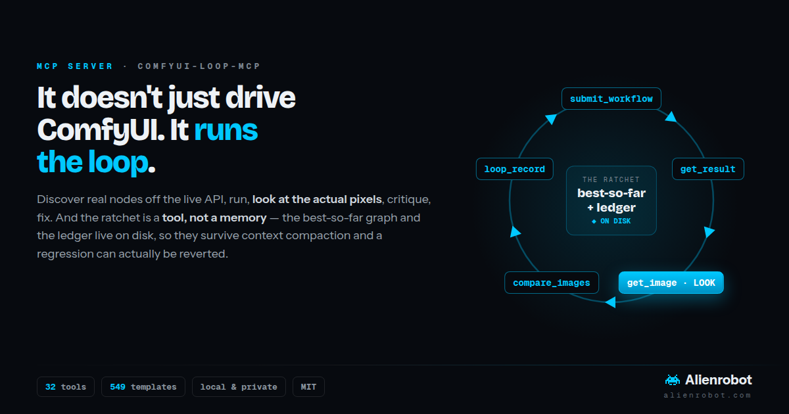
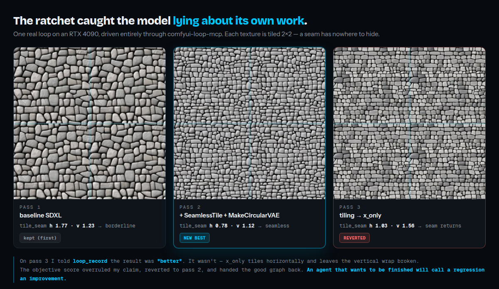

# comfyui-loop-mcp



**A loop-aware [MCP](https://modelcontextprotocol.io) server for your own ComfyUI.**
It doesn't just call the API — it runs the loop: **build → run → _look_ → critique → fix**,
until the output actually meets the brief.

A graph that runs with zero `node_errors` is **valid, not correct**. Mangled hands, a
drifted background, a hard matte edge, a visible tile seam — none of that shows up in an
error log. It only shows up in the pixels. So every tool description, every tool
response, and the server's own instructions push the model to *look* before it declares
a graph done.

**The part nobody else has: the ratchet is a tool, not a suggestion.**
Most agent tooling drives ComfyUI. This one *manages the loop* — a long loop gets its
context compacted, and the moment that happens a remembered "best-so-far" is gone: the
ratchet silently stops ratcheting, the model retries changes it already rejected, and it
can hand you a regression as the final answer. So the **best graph and the ledger live
on disk**, not in the model's memory. Reverting is a tool call, not an act of recall.

```
loop_start ─▶ submit ─▶ get_result ─▶ get_image ─▶ compare_images ─▶ loop_record ─┐
     ▲                                   (LOOK)      (what moved?)    (ratchet)   │
     └───────────────────  revert to best, try something else  ◀─────────────────┘
                                                          ↓ can't name a defect?
                                           loop_finish + loop_report → sign-off
```

Companion to [**comfyui-llm-onboarding-prompt**](https://github.com/huikku/comfyui-llm-onboarding-prompt)
— the pasteable prompts + Claude Code skill this server makes *executable*. Those docs
ship inside the package, so `comfy_loop` / `comfy_skill` serve them verbatim and never
drift.

- [How it compares to Comfy's own MCP servers](#how-it-compares-to-comfys-own-mcp-servers) — the local one and the cloud one, honestly
- [Design position: discovery vs. repair](DESIGN.md) — where a local tool genuinely wins/loses, and the north star
- [The three MCP primitives](#the-three-mcp-primitives-mapped-to-the-loop)
- [Tool reference](#tool-reference)
- [Watch the loop actually work](#watch-the-loop-actually-work)
- [Install & connect](#install)
- [Pointing at a remote ComfyUI](#pointing-at-a-remote-comfyui)

---

## How it compares to Comfy's own MCP servers

ComfyUI ships **two** official servers, and this is a third thing built alongside
them — independently, and from the other end of the problem.

**[Comfy-Org/comfy-mcp](https://github.com/Comfy-Org/comfy-mcp)** (first commit
2026-07-01, one day after this one, though it was public first) drives a local
ComfyUI through **`comfy-cli`**: every tool shells out to the `comfy` binary and
parses its JSON envelope. **Comfy Cloud MCP** (`https://cloud.comfy.org/mcp`) is a
remote HTTP server that runs the graph on Comfy's GPUs. Both are built and
maintained by the ComfyUI team.

This one speaks **HTTP to `/prompt` and `/object_info` directly** — no CLI, no
account, nothing to install beyond `httpx` — and spends its surface area on the
half of the job that starts *after* a graph runs.

### The actual difference

Their local server treats the ComfyUI install as the thing to manage: launch it,
stop it, roll it to another version, sign in, spend credits on hosted partner
models, tail its logs, keep the packs updated. That is a genuinely bigger surface
than this repo has, and if what you need is *drive and maintain my install*, it
is the better tool — production code, real team, security policy, a release
cadence.

This one treats the **output** as the thing to manage. Nothing here launches a
process or spends a credit. Instead: return the pixels to the model, diff two
passes into an image where drift can't hide, score the thing the brief actually
demands, and hold the best-so-far **on disk** so a compacted context can't lose
it. That's the part no one else has — not because it's hard to call `/view`, but
because "make the agent look, and stop it building on a regression" is a
discipline, not an endpoint.

| | **this repo** | **Comfy-Org/comfy-mcp** |
|---|---|---|
| **Talks to ComfyUI via** | its HTTP API (`/prompt`, `/object_info`, `/view`) | `comfy-cli` subprocesses (`comfy … --json`) |
| **Extra dependency** | none (`httpx`, `pillow`) | `comfy-cli` ≥ 1.14, and an install it knows about |
| **Sees a ComfyUI you didn't install** | yes — anything the URL reaches, incl. a box you have no shell on | partially; some tools are local-only by construction |
| **Look at the result** | `get_image`, `get_video_frame` — pixels back to the model | `fetch_outputs(inline_images=True)` |
| **Judge the result** | `compare_images` (difference mode), `image_diff_stats`, `measure_image` (tile-seam / sharpness), `video_temporal_stats` | — |
| **Keep the best one** | `loop_*`: ratchet + ledger on disk, revert is a tool call | — |
| **Explore a parameter** | `loop_sweep` — one input, N values, one call, recorded in the run | `vary_workflow` — cross-product of slot values into files |
| **Pre-flight a graph** | `check_workflow` — missing packs, missing model FILES, unset required inputs, dead wires, no output node, in one answer | `validate_workflow` + `workflow_deps` + template `local_check` |
| **Subgraph templates** | expanded and rewired (promoted widgets kept) | expanded client-side |
| **Token cost of discovery** | compact node notation (93% off `object_info`, 987 nodes); FlowZip graphs ~72% off litegraph | not a stated goal |
| **Install what's missing** | ComfyUI-Manager: `install_node_pack`, `install_model`, `restart_comfyui`, `update_comfyui` | registry `install_node`, `download_model` (backgrounded, cancellable), full update/version-switch |
| **Run the ComfyUI process** | no — restart only (via Manager) | `launch_comfyui`, `stop_comfyui`, `switch_comfyui_version` |
| **Hosted/partner models, accounts, credits** | no, deliberately | `auth_login`, `partner_generate`, spend-consent gates |
| **Job control** | `submit_workflow`, `job_status`, `cancel_job`, `get_queue`, `interrupt` | one `job` tool: status / wait / watch / cancel / queue |
| **MCP surface** | 43 tools + 2 prompts + 3 resources | 39 tools |
| **Size / licence** | ~3,700 lines, MIT | ~16,000 lines, AGPL-3.0-or-later or commercial |
| **Maintenance** | hobby code, one author | production, ComfyUI team |

### Which to use

- **No GPU** → **Cloud MCP**. Nothing local competes with hardware you don't have.
- **"Install it, run it, keep it working"** → **Comfy-Org/comfy-mcp**. Lifecycle,
  partner models, background downloads, a maintained release train.
- **"The first result runs, and a trained eye rejects it"** → **this one.** Six
  fingers, a drifted background, a hard matte edge, a visible tile seam, a clip
  that boils. That's a loop, and this is a server built entirely around it.

They compose: nothing stops you running both, and the tool names don't clash.
(The *package* names did — this one was `comfy-mcp` too, briefly, which is a losing
argument to have with the people who own the ComfyUI namespace. Hence
`comfyui-loop-mcp`; the import package is `comfy_loop`, and both can be installed
side by side.)

### What we're not going to add

Absorbing a competitor's feature list wholesale is how you end up with two
mediocre tools. What's here from theirs is what a **loop** needs — pre-flight,
job status, log tailing, VRAM headroom, updates. What stays out, on purpose:

- **Accounts, credits, hosted partner models.** The pitch is "nothing leaves your
  machine, no signup, no meter." A credit gate contradicts it. If you want Kling
  or Veo, their server does it properly, with consent gates this repo has no
  reason to reinvent.
- **Launching and stopping the ComfyUI process.** An HTTP client cannot start a
  server that isn't running, and pointing this at a box you have no shell on is a
  supported case, not an edge one. `restart_comfyui` (via Manager) is the honest
  limit.
- **Workflow save / share / reproduce as a service.** `save_workflow` hands you a
  round-trip-verified file. Where it lives after that is your business.

## The three MCP primitives, mapped to the loop

| Primitive | What it exposes | Loop step |
|---|---|---|
| **Tools** | `check_comfyui`, `list_nodes`, `get_node`, `list_models`, `search_models`, `search_templates`, `get_template` | Discover, don't guess |
| | `find_missing_nodes`, `install_node_pack`, `install_model`, `restart_comfyui`, `update_comfyui` | Extend (install what a template needs) |
| | `check_workflow` | Verify before the GPU is involved |
| | `inflate_workflow`, `flowzip_to_api` | Compress (token-efficient graphs) |
| | `template_slots`, `run_template` | Run a known-good template with overrides (no graph in context) |
| | `upload_image`, `submit_workflow` | Build → Run |
| | `get_result`, `get_image` (returns the actual image) | **Look** |
| | `loop_start`, `loop_record`, `loop_sweep`, `loop_best`, `loop_ledger`, `loop_finish`, `loop_report` | Ratchet + ledger, on disk |
| | `system_stats`, `get_queue`, `job_status`, `cancel_job`, `interrupt`, `free_vram`, `comfyui_logs` | Control |
| **Prompts** | `comfy_loop` (full method), `comfy_skill` (compact) | The whole discipline, one command |
| **Resources** | `comfyui://object_info` (live), `comfyui://loop-method`, `comfyui://skill` | Truth + docs |

Three things make it *loop-aware* rather than a plain API wrapper:

1. **`get_image` returns the rendered output to the model** — that's the step
   that makes "look" real. The model literally sees the pixels.
2. **Tool responses push the loop.** `submit_workflow` on success says
   *"valid, not correct — now LOOK"*; on a rejection it says *"not an iteration —
   fix the named node and re-submit."* `get_result` ends with a directive:
   *"do not stop here — LOOK, then change one parameter or declare the brief met."*
3. **The server instructions carry a prefer-looping policy** (see below) that the
   client injects at connect time.

### The prefer-looping policy (server instructions)

At handshake the server tells the agent *when to loop and when not to*:

- **ALWAYS** discover from the live API before writing JSON; validate by
  executing; `node_errors` are not iterations — fix and re-submit.
- **PREFER LOOPING** whenever a trained eye could reject the output — composition/
  count, likeness, matte/edge quality, upscale/restore, relight, texture seams,
  video temporal stability, "make it look right."
- **RATCHET** — hold a best-so-far; keep a change only if it beats it, else revert
  and try something different; pivot param → wiring → model on plateau. Gate on an
  objective test only where the brief has one; judge by eye otherwise.
- **SKIP** the loop only for mechanical tasks (format conversion, a pure API
  query, or when the user explicitly wants just a runnable graph).
- **When unsure**, do at least one look-and-critique pass before declaring done.

The ratchet/ledger/pivot are adapted from [Karpathy's AutoResearch loop](https://www.nextbigfuture.com/2026/03/andrej-karpathy-on-code-agents-autoresearch-and-the-self-improvement-loopy-era-of-ai.html), tuned for subjective image work (objective gate only where one exists; a human sign-off checkpoint instead of running forever). These policy lines live in the server `instructions` + tool responses; the full method is in the `comfy_loop` prompt, which serves the repo's loop doc verbatim.

> MCP can't *force* behavior — it exposes capabilities and guidance. This makes
> looping the strong, well-scoped default the agent is repeatedly told to prefer.
> For a hard guarantee in Claude Code, also install the auto-loading
> [`comfyui-workflows` skill](https://github.com/huikku/comfyui-llm-onboarding-prompt/blob/main/skills/comfyui-workflows/SKILL.md) — skill = always-on discipline, MCP = the tools it drives.

---

## Tool reference

**Discover**
| Tool | Args | Returns |
|---|---|---|
| `check_comfyui` | — | Loop step 0, and a real preflight: node count, ComfyUI/torch versions, per-device VRAM **free vs total**, whether ComfyUI-Manager is present (no Manager = no installs, no restart), and whether the queue is already busy — or a clear "not reachable". |
| `list_nodes` | `keyword=""` | Nodes whose **class name or display name** matches (a strict superset of the skill's class-only search). Omit keyword for the count. |
| `get_node` | `class_name`, `verbose=False` | One node's interface as **compact** `@Name +req:T ?opt:T -out:T` (~90% fewer tokens); `verbose=True` for full JSON (defaults, min/max). |
| `list_models` | `class_name`, `input_name=""` | The real model files a loader offers **on disk** (ground truth), read from its enum — handles both the legacy list and `COMBO` encodings. Never hallucinate a filename. |
| `search_models` | `keyword=""`, `model_type=""` | The downloadable model **catalog** (ComfyUI-Manager's list) — find checkpoints/LoRAs/VAEs/upscalers you may not have yet; each result flags whether it's already installed. Install with `install_model`. |
| `search_templates` | `keyword=""`, `source="online"` | `online` (default): the full open catalog (`Comfy-Org/workflow_templates`, ~550), searched by name/title/description live from GitHub — no install. `installed`: only what's on this ComfyUI. |
| `get_template` | `name`, `pack=""`, `source="online"`, `fmt="flowzip"` | Fetches a template. `fmt="flowzip"` (default) is compact FlowZip text (~72% smaller than raw litegraph JSON, median); `fmt="json"` for full litegraph. Either way it's litegraph — convert with `flowzip_to_api` before submitting. An online template may need nodes/models you lack — check with `find_missing_nodes`. |
| `inflate_workflow` | `flowzip` | Expands FlowZip text back into full litegraph JSON. |
| `flowzip_to_api` | `flowzip` | Converts FlowZip/litegraph → API/prompt format for `submit_workflow`: resolves links, maps widget values to named inputs (type-coerced), and **follows `Reroute` passthroughs back to the real producer** — a reroute has no backend class, so a link pointing at one has to be rewired or the API graph references a node that doesn't exist (dangling and cyclic chains are reported, not crashed on). **Subgraphs are expanded**, not skipped: interiors arrive namespaced `<instance>:<inner>`, rewired across the boundary, with promoted widget values preserved. Unknown classes are still skipped and reported. Review before running; `check_workflow` catches the rest before you spend a GPU minute. |
| `template_slots` | `name`, `source="online"`, `pack=""` | Lists a template's overridable inputs (node_id → params + current values) **without loading the full graph** — including parameters inside subgraphs. Also returns the author's own Note/MarkdownNote text, where trigger words and required weights actually live, quoted as **untrusted data** rather than instructions. |
| `run_template` | `name`, `overrides={}`, `source="online"`, `pack=""` | Runs a known-good template with `{node_id: {input: value}}` overrides — fetch → convert → apply → submit — without dumping the graph into context. Then `get_result`/`get_image`. Subgraph templates run — their interiors are expanded on the way through. |

**Extend** (install what a template needs — requires [ComfyUI-Manager](https://github.com/Comfy-Org/ComfyUI-Manager) on the host)
| Tool | Args | Returns |
|---|---|---|
| `find_missing_nodes` | `name`, `pack=""`, `source="online"`, `workflow=None` | Diffs node classes against `/object_info` and resolves each missing one to the installable pack id. Works on a **template** or on a `workflow` you already have (API format or litegraph), recursing into subgraphs. Read-only. |
| `install_node_pack` | `pack_id`, `version="latest"` | Installs a pack via ComfyUI-Manager's queue (trusted registry, no arbitrary code). Then a restart is required. |
| `install_model` | `name` | Downloads a catalog model (from `search_models`) into the right `models/<type>/` folder via Manager. No restart needed — verify with `list_models`. |
| `restart_comfyui` | — | Restarts ComfyUI (via Manager) so new nodes register in `/object_info`. Reports failure honestly: an HTTP *response* means nothing restarted. |
| `update_comfyui` | `target="comfyui"\|"nodes"\|"all"` | Updates ComfyUI core and/or every installed pack via Manager's queue, then tells you a restart is required. Runs third-party code — say so first. **Not mid-loop**: it moves node behaviour under a ratchet whose earlier passes were measured against the old code. |

**Verify** — everything knowable before the GPU is involved
| Tool | Args | Returns |
|---|---|---|
| `check_workflow` | `workflow` (API dict or litegraph) | One answer to "will this run on **this** box": node classes you don't have (resolved to pack ids in the same pass), model filenames that aren't in that loader's list (with the nearest thing you *do* have), required inputs left unset, wires pointing at absent nodes, values outside a node's declared range, and a graph with **no output node** — which runs green and produces nothing to look at. `/prompt` finds these too: one per submit, with a missing checkpoint looking exactly like a missing pack. Clean here means well-formed, **not** correct — you still have to look at the pixels. |

**Build → Run → Look**
| Tool | Args | Returns |
|---|---|---|
| `upload_image` | `path`, `overwrite=True` | Uploads a local image to ComfyUI's `input/` dir; returns the name to reference in a `LoadImage` node. |
| `submit_workflow` | `workflow` (API-format dict), `client_id` | On success: `prompt_id` + a "now LOOK" nudge. On failure: `node_errors` + a "fix that node, re-submit" nudge. |
| `get_result` | `prompt_id`, `timeout_s=120` | Polls `/history`; returns each output's `filename`/`subfolder`/`type`, reports how many nodes were **served from cache** (with fixed seeds only the nodes downstream of your edit re-run — iterations are cheap on purpose), + a directive to look and iterate. A run that **died mid-execution** comes back as the failing node and its exception (OOM gets a "free_vram, then lower resolution" nudge) instead of the misleading "finished but produced no outputs". |
| `get_image` | `filename`, `subfolder=""`, `image_type="output"` | The **actual image**, returned to the model so it can judge the pixels. |
| `compare_images` | `filename_a`, `filename_b`, `mode="side_by_side"\|"difference"`, `amplify=1.0` | The comparison as an **image**. `difference` = `0.5+0.5*(a−b)`: identical regions read flat mid-gray, so drift you'd never catch by eye pops. An MCP client has no shell for ffmpeg — without this, "diff your outputs" is unexecutable. |
| `image_diff_stats` | `filename_a`, `filename_b` | Mean/max absolute difference + **% of pixels changed** — the "I changed only what I meant to" gate. Catches the 'small tweak' that quietly rewrote the frame. |
| `measure_image` | `filename`, `metric="sharpness"\|"tile_seam"\|"brightness"` | An **objective score** for the ratchet, where the brief has an objective test. `tile_seam` compares the wrap-around join to an interior join (~1.0 = genuinely tiles, >2 = a real seam — the claim an eye waves through); `sharpness` = edge energy, rises with real detail, falls when a pass just softened the image. |
| `video_info` | `filename`, `subfolder=""` | Dimensions, fps and **frame count** for a video output. Call it before indexing frames — you need the range, and you need to know whether two clips you're about to compare are even the same length. |
| `get_video_frame` | `filename`, `frame=0`, `subfolder=""` | One frame of a video output **by frame index**, returned as an image. The video half of `get_image`: `get_result` already reports `gifs`/`videos`, but every other LOOK tool is Pillow-only and can't decode an mp4 — so for VHS/AnimateDiff/WAN graphs "call get_image and LOOK" was unexecutable. |
| `compare_video_frames` | `filename_a`, `filename_b`, `frame=0`, `mode="side_by_side"\|"difference"`, `amplify=1.0` | Same comparison, at the **same frame index in both clips**. Comparing by timestamp goes quietly wrong the moment lengths differ (a frame cap, a trim, a different fps) — you compare two unrelated moments with full confidence. On a frame-count mismatch the warning is **burned onto the image**, not left in text you can skim past. |
| `video_temporal_stats` | `filename`, `stride=1`, `max_frames=120`, `roi=None` | Frame-to-frame instability as a number — the objective gate for "does it boil?", which **no single still can show**. Naive consecutive-frame difference, so real motion counts: use it on the SAME clip before/after a change, or pass an `roi` over a region that should be static. Validated on a known pair (raw per-frame swap 3.53 → optical-flow smoothed 2.38). |

**The loop, as durable state** — the ratchet is a *tool*, not a memory exercise.
A long loop gets compacted; if best-so-far and the ledger live only in the model's
context, the ratchet silently stops ratcheting, the model retries changes it already
rejected, and it can hand back a regression as final. So they live on disk.

| Tool | Args | Returns |
|---|---|---|
| `loop_start` | `brief`, `gate=""` | Opens a run → `run_id`. `gate` is the objective test **if the brief has one** ("must tile seamlessly", "exactly 3 apples"). |
| `loop_record` | `run_id`, `change`, `outcome`, `graph=None`, `score=None` | Records a pass and **applies the ratchet**. `"better"` stores that graph as the new best (revertible). `"worse"`/`"same"` hands the **best graph straight back** so reverting is one call — plus the list of changes already tried, so it doesn't repeat a dead end. If both passes carry an objective `score`, **the number overrides the verdict** — a model that wants to be finished will call a regression "better". |
| `loop_sweep` | `run_id`, `workflow`, `node_id`, `input_name`, `values` | Runs the same graph across up to 8 values of **one** input, in one call — for the values you can't reason your way to (denoise, cfg, strength). Everything else is held identical, so the outputs differ by exactly one variable. The value → `prompt_id` table is written **into the run**, so a compacted model recovers it from `loop_ledger` instead of re-running the sweep. A sweep produces **one** recorded pass, not N. |
| `loop_best` | `run_id` | The best-so-far graph. The source of truth after a compaction — your recollection isn't. |
| `loop_ledger` | `run_id` | The append-only loop log: every pass, what changed, what it did. Recovers the thread after compaction; it's also the log you hand the user at sign-off. |
| `loop_finish` | `run_id`, `summary=""` | Closes at the convergence checkpoint; returns the final ledger + best graph to present for sign-off. |
| `loop_report` | `run_id`, `out_path=""` | Renders the whole run as one self-contained HTML page — every pass, what was kept, what was reverted, thumbnails base64-inlined so it opens with ComfyUI off. The final image proves nothing; the passes you threw away are what show the loop converged. |

**Deliver**
| Tool | Args | Returns |
|---|---|---|
| `save_workflow` | `workflow` (API dict), `name=""`, `save=True` | API → **UI/litegraph** so a human can open and edit it, saved into ComfyUI's workflows list. **Round-trip verified**: the result is converted back to API and diffed against your input, because `widgets_values` is positional and a silent off-by-one shifts parameters — a plausible-but-wrong file is worse than none. |

**Control**
| Tool | Args | Returns |
|---|---|---|
| `system_stats` | — | Device / VRAM (useful when tuning resolution/batch or after an OOM). |
| `get_queue` | — | What's running and pending. |
| `job_status` | `prompt_id` | Where one run is **without blocking**: queued (with its position), running, done with N outputs, or the execution error that killed it. What you want with several in flight — a `loop_sweep`, say. |
| `cancel_job` | `prompt_id=""` | Drops **one** queued run, or interrupts it if that id is the one executing. No id clears the pending queue and leaves the running job alone. `interrupt` is the blunt version. |
| `interrupt` | — | Cancels the current run. |
| `free_vram` | `unload_models=True` | Unloads models and resets the executor cache (`POST /free`). The loop's own cheapness works against you here — cached passes are VRAM — so this is the cheap thing to try before rewriting a graph that OOM'd. Not immediate (lands on the queue worker's next iteration) and can't touch another process's VRAM; confirm with `system_stats`. |
| `comfyui_logs` | `lines=60`, `grep=""` | Tails ComfyUI's own log, where failures explain themselves: the traceback inside a node, the OOM, the custom node that failed to import at startup (which is *why* its class is missing from `object_info`). |

**Prompts:** `comfy_loop` (full autonomous method), `comfy_skill` (compact skill) —
both served verbatim from the repo's markdown.
**Resources:** `comfyui://object_info` (live full dump), `comfyui://loop-method`,
`comfyui://skill`.

---

## Watch the loop actually work

Driven entirely through this MCP server against a real ComfyUI (RTX 4090, SD1.5),
brief: *"a crisp, sharply focused macro studio photo of a single red apple on a
warm wooden table, fine skin texture, rich detail."* Seed fixed at 42 so each
pass changes exactly **one** knob and the effect is attributable. The objective
metric is variance-of-Laplacian (a standard sharpness/focus measure).


| Pass | One change | Sharpness (varLap) | Verdict by **looking** |
|---|---|---:|---|
| 1 | baseline — 6 steps, cfg 2.5 | 425 | Soft, flat, matte. Weakest. |
| 2 | steps 6 → 24 | **1204** | Sharper — but the high number is the **wood grain**, apple skin still plasticky. |
| 3 | cfg 2.5 → 7.5 | 515 | Apple gets *richer* (saturated, skin speckles) — metric **drops** because the background softened. |
| 4 | euler → dpmpp_2m + karras | 740 | **Winner.** Crisp highlight, visible lenticels, believable wood. |
| 5 | steps 24 → 36 | 661 | ≈ pass 4. Diminishing returns → **stop.** |

The lesson the loop is built on, caught live: **the metric peaked at pass 2, but
pass 2 is not the best image** — its score was inflated by background texture,
not apple detail. The winner (pass 4) was chosen by *looking*. A green number is
*valid, not correct*. ([example_apple.png](example_apple.png) is that pass-4 result.)

### …and the other half: when the model is the one that's wrong

The apple shows why you can't trust the **metric** blindly. This run shows why you
can't trust the **model** blindly — which is the entire reason the ratchet is a tool
and not a note in a prompt.

Brief: *"a seamlessly tileable cobblestone texture — no visible seam at the wrap,"*
with an objective gate (`measure_image` → `tile_seam`). Same seed throughout, so each
pass changes exactly one thing. Every texture below is **tiled 2×2** — a seam has
nowhere to hide.



| Pass | One change | `tile_seam` | Ratchet |
|---|---|---|---|
| 1 | baseline SDXL | h 1.77 · v 1.23 → borderline | kept (first) |
| 2 | `SeamlessTile` + `MakeCircularVAE` | **h 0.78 · v 1.12 → seamless** | **NEW BEST** |
| 3 | `tiling` → `x_only` | h 1.03 · v **1.56** → seam returns | **REVERTED** |

On pass 3 the model told `loop_record` the result was **`"better"`**. It wasn't:
`x_only` tiles horizontally and leaves the *vertical* wrap broken — visible in the
right-hand image as stones chopped flat against the horizontal join. **The objective
score overruled the claim, restored pass 2, and handed the good graph back.**

That is the failure this server exists to prevent: *an agent that wants to be finished
will call a regression an improvement.* If best-so-far had lived in the model's context
instead of on disk, that regression would have been the final answer.

---

## Install

```bash
git clone https://github.com/huikku/comfyui-loop-mcp && cd comfyui-loop-mcp
pip install -e .            # or: uv pip install -e .
```

Requires Python ≥ 3.10 and a reachable ComfyUI. Installs `mcp[cli]`, `httpx`,
`anyio`, `pillow`. Works on both MCP SDK **1.x and 2.x** — 2.0 renamed `FastMCP`
to `MCPServer` and moved the `Image` helper, which the server imports either way.

> **Had this installed as `comfy-mcp`?** That name belongs to
> [Comfy-Org's server](https://github.com/Comfy-Org/comfy-mcp) on PyPI, so this one
> is now `comfyui-loop-mcp` (import package `comfy_loop`, command
> `comfyui-loop-mcp`). Run `pip uninstall comfy-mcp` first, and update your MCP
> client config. Loop runs already on disk are found automatically — the old
> `~/.comfy-mcp/runs` keeps being used until you point `COMFY_LOOP_STATE_DIR`
> somewhere else.

## Connect (Claude Code)

```bash
claude mcp add comfyui -- comfyui-loop-mcp
```

Or wire it manually in any MCP client config:

```json
{
  "mcpServers": {
    "comfyui": {
      "command": "comfyui-loop-mcp",
      "env": { "COMFYUI_URL": "http://localhost:8188" }
    }
  }
}
```

## Config

| Env var | Default | Purpose |
|---|---|---|
| `COMFYUI_URL` | `http://localhost:8188` | Your ComfyUI server |
| `COMFYUI_ONBOARDING_DIR` | repo root above this package | Where the `comfy_loop` / `comfy_skill` prompts read their markdown |
| `COMFYUI_TEMPLATES_REF` | `main` | Git ref of `Comfy-Org/workflow_templates` the online template catalog reads |
| `COMFYUI_TEMPLATES_LIVE` | unset | Set to `1` to fetch the freshest catalog index from GitHub instead of the bundled compressed snapshot |
| `COMFY_LOOP_STATE_DIR` | `~/.comfyui-loop-mcp/runs` | Where the ratchet and ledger live. Falls back to a pre-rename `~/.comfy-mcp/runs` if that's where your runs already are |

## Pointing at a remote ComfyUI

ComfyUI usually binds to `127.0.0.1`, so a ComfyUI on another machine isn't
reachable across the network by default. Two options:

- **SSH tunnel (simplest, keeps ComfyUI private):** forward the port, then leave
  `COMFYUI_URL` at localhost:
  ```bash
  ssh -N -L 8188:localhost:8188 your-remote-host
  # COMFYUI_URL stays http://localhost:8188
  ```
- **Bind ComfyUI to the network** and point at it directly (only on a trusted
  network — this exposes an unauthenticated API):
  ```bash
  python main.py --listen 0.0.0.0 --port 8188
  # COMFYUI_URL=http://<remote-ip>:8188
  ```

## Use it

1. In your agent, load the **`comfy_loop`** prompt (or let it read the
   `comfyui://loop-method` resource) to pull in the full method. If your client
   injects server instructions, the prefer-looping policy is already active.
2. Give it a goal. It will `check_comfyui` → `list_nodes` / `get_node` /
   `list_models` → build API-format JSON → `submit_workflow` → `get_result` →
   `get_image`, then critique and iterate — one change per pass — until it can't
   name a defect, then present the result for sign-off.

## Troubleshooting

- **"ComfyUI is NOT reachable"** — it isn't running, is on another port, or (for
  a remote box) needs a tunnel. Check `COMFYUI_URL`; `check_comfyui` reports the
  exact URL it tried.
- **Node/model not found** — install the pack/model on the ComfyUI side, then
  **restart ComfyUI** so `/object_info` reflects it (the API is stale until then).
- **`get_image` returns nothing** — make sure the graph has a `SaveImage` /
  `PreviewImage` node; `get_result` lists what was actually produced.
- **`install_node_pack` blocked / no-op** — the install tools need
  [ComfyUI-Manager](https://github.com/Comfy-Org/ComfyUI-Manager) on the host,
  and Manager's security level must permit API installs. After installing,
  `restart_comfyui` is required before `/object_info` shows the new nodes.
- **`find_missing_nodes` picks the "wrong" pack** — several packs can export a
  same-named node; resolution takes the first registry match. If an install
  doesn't provide the class, check the reported pack and install the right one
  explicitly.

## License

MIT.
